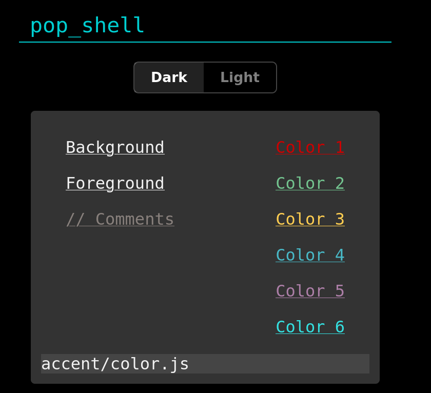
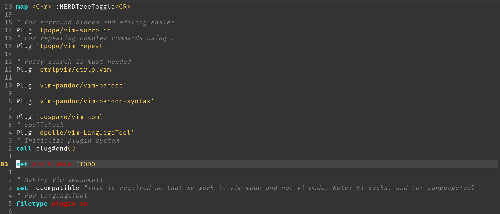

# pop_shell_dark.vim

[Pop Shell Dark](https://github.com/siddhantladdha/pop_shell_dark) for vim. Generated with [vimcolors.org](https://vimcolors.org) 





## Install

Use [vim-plug](https://github.com/junegunn/vim-plug) or any other plugin manager of your choice:

```viml
Plug 'siddhantladdha/pop_shell_dark'
```

And then set the colorscheme.

```viml
colorscheme pop_shell_dark
```

## Related

[vimcolors.org](https://vimcolors.org): The tool I used to generate this theme

## Licence

CC0 - Public Domain
